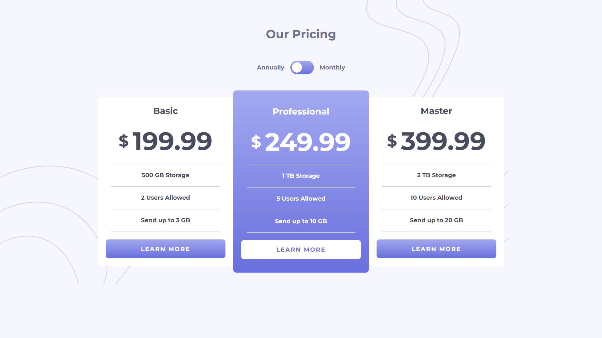

# Frontend Mentor - Pricing component with toggle solution

This is a solution to the [Pricing component with toggle challenge on Frontend Mentor](https://www.frontendmentor.io/challenges/pricing-component-with-toggle-8vPwRMIC).

## Table of contents

- [Overview](#overview)
  - [The challenge](#the-challenge)
  - [Screenshot](#screenshot)
  - [Links](#links)
- [My process](#my-process)
  - [Built with](#built-with)
  - [What I learned](#what-i-learned)
  - [Continued development](#continued-development)
- [Author](#author)

## Overview

### The challenge

Users should be able to:

- View the optimal layout for the component depending on their device's screen size
- Control the toggle with both their mouse/trackpad and their keyboard

### Screenshot

### Links

- Live Site URL: [GitHub Pages](https://dpass47.github.io/pricing-component/)

## My process

I initially started out building the framework of the website with HTML. After completely building the backbone of the site, I added class names to all the different components of the application. I tried using Syntactically Awesome Style Sheets (SASS) for the first time, so I began building the styling for the application using it. I initially started building the layout of the application using Flexbox. Once I had the general layout completed, I started adding the rest of the styling features (backgrounds, color, fonts, etc.). I started with a mobile-first design methodology and added media queries to change the display of the site depending on screen size. After having the layout and design completed using SASS, I moved on to JavaScript. In JS, I grabbed the slider component using querySelector to add an event listener to listen for 'change'. Inside the event listener function, I used a for loop to ultimately change the price for each card. To achieve the change in price, I had a separate price within the HTML document that I had a display of none on. The function would change the price by changing the display back and forth between none and flex.

### Built with

- Semantic HTML5 markup
- Syntactically Awesome Style Sheets (SASS)
- JavaScript
- Flexbox
- Mobile-first workflow

### What I learned

I learned a lot with this project. I am trying to better my code structure as well as my clean code principles. I learned quite a bit in regards to SASS. I used some basic features of SASS, but it was a good first using of it. I felt like I learned some of the aspects of SASS and will continue to look for opportunities to use it to continue to better my understanding. I also learned more about Git, using the commands in the terminal to stage and commit changes. I felt lime I learned more in general CSS styling, as I had some styling I hadn't run into before.

### Continued development

I do want to continue to focus on using more CSS/SASS properties to help build stunning designs in the overall web application. One thing I really want to focus on moving forward would be clean code principles and general layout of my code. I feel at times i can get a bit disorganized, so I want to try to get better with comments in my code along with laying out my code cleaner and more structured to have easier access to lines I need to change.

## Author

- Website - [Dante Passalacqua](https://www.devdante.com)
- Twitter - [@dpass47](https://www.twitter.com/dpass47)
